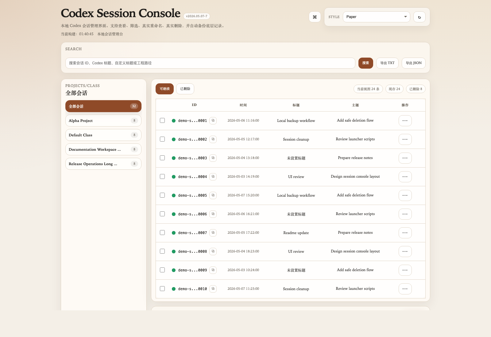
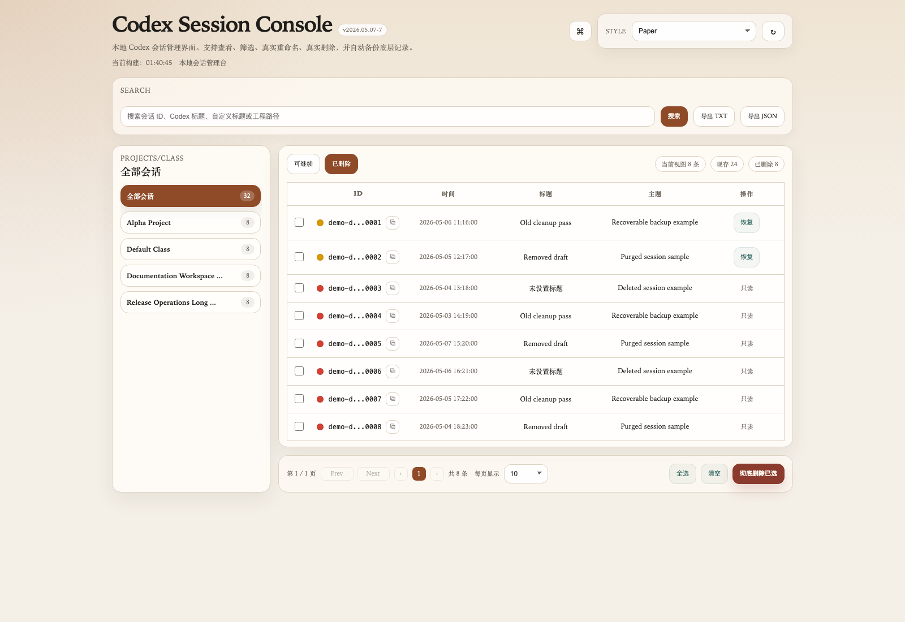
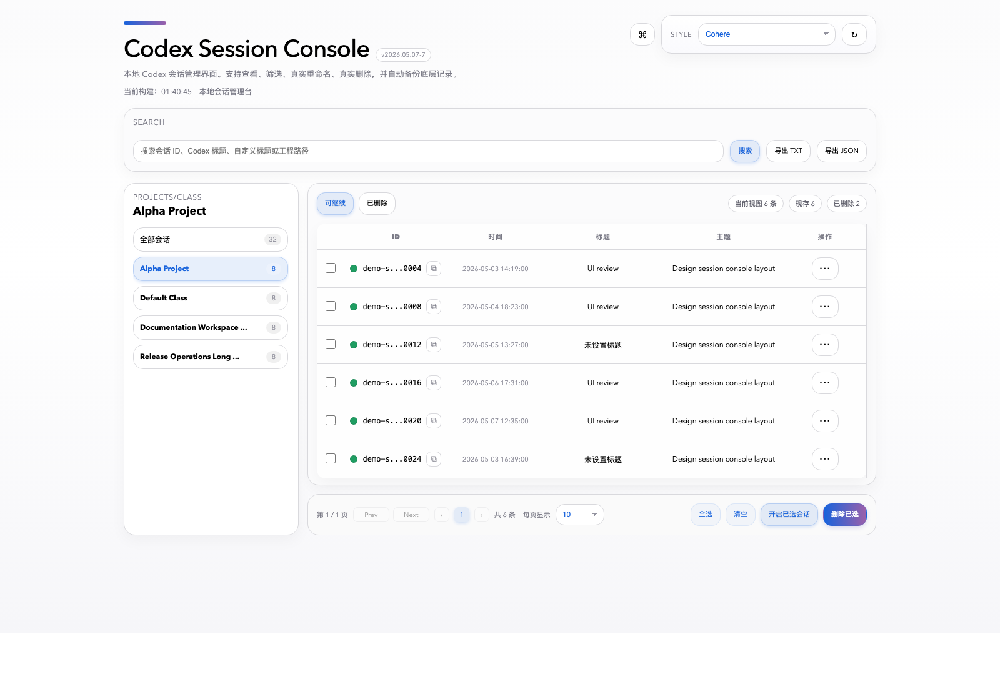
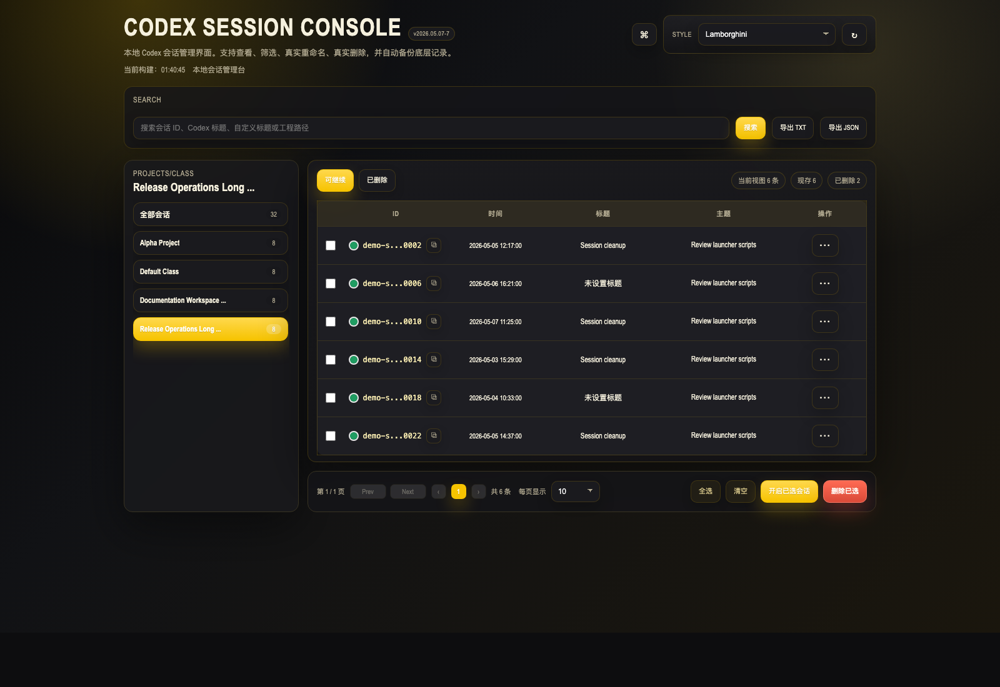

# Codex Session Console

A local session management tool for Codex.

Its purpose is straightforward:
- turn the session data inside `~/.codex` into a visual, searchable list
- let you filter, rename, delete, and restore sessions directly in the UI
- provide `txt` and `json` exports for backup, archiving, or further processing
- back up underlying data automatically before high-impact operations

The current version runs as a local Web UI by default and also supports desktop-style launchers:
- macOS: desktop `.app`
- Linux: `.desktop` entry

## Screenshots

### Overview



### Deleted Sessions and Restore State



### Theme Examples





## When This Is Useful

- You have many Codex conversations and want a single place to inspect and clean them up.
- You want to assign clearer titles to important sessions.
- You want to distinguish between existing, deleted, recoverable, and non-recoverable sessions.
- You want to export local session data as `txt` or `json`.

## Features

- Session list view
- Status filters: `Existing / Deleted / All`
- Search by `ID / topic / title`
- Set custom titles in the UI
- Bulk delete for existing sessions
- Permanent delete for already deleted sessions
- Restore deleted sessions when single-session recovery is supported by backups
- Export as `txt` / `json`
- Multiple built-in themes
- Desktop launch support for macOS and Linux
- Self-healing writes for damaged `threads` table metadata

## Requirements

- `python3` must be available
- To see actual session data, the machine must have local Codex data in `~/.codex`
- Desktop launcher support:
  - macOS: `.app`
  - Linux: `.desktop`

If the target machine does not have Codex installed, or does not have local session data:
- the app can still start
- the page will simply be empty
- it should not crash just because data is missing

## Quick Start

### Option 1: Run from the command line

From the project directory:

```bash
python3 app.py --open
```

This starts the local server and opens the UI in your browser.

If you want to start the server without opening the browser automatically:

```bash
python3 app.py
```

Default address:

```text
http://127.0.0.1:8876
```

### Option 2: Double-click the project launcher

The project root already includes a macOS launcher:

```text
Launch Codex Session Manager.command
```

Double-clicking it will:
- start the local service
- open the UI automatically

### Option 3: Install the macOS desktop app

If you want a desktop icon on macOS:

```bash
./tools/install_mac_app.sh
```

This creates:

```text
Codex Session Console.app
```

on your Desktop, and you can then launch it by double-clicking the app.

If you move the project directory later, run the installer again.

### Option 4: Install the Linux desktop entry

On Linux:

```bash
./tools/install_linux_app.sh
```

This script creates:
- `~/.local/bin/codex-session-console`
- `~/.local/share/applications/codex-session-console.desktop`
- `~/Desktop/Codex Session Console.desktop` if a Desktop directory exists

After that, you can:
- search for `Codex Session Console` in your application menu
- or double-click `Codex Session Console.desktop` on the Desktop

Some Linux desktop environments require an extra confirmation the first time you open a `.desktop` file, such as:
- `Allow Launching`
- or a trust/launch confirmation

## How to Use the UI

### 1. Header area

The top-right controls let you:
- switch themes
- refresh the page
- open the quick command menu

### 2. Search area

You can search by:
- session ID
- topic
- custom title

### 3. List area

You will see three views:
- `Existing`
- `Deleted`
- `All`

Inside the list, you can:
- copy session IDs
- set titles with the direct rename button in each existing-session row
- inspect status dots
- restore deleted sessions when single-session restore is available

Status dot meanings:
- Green: session can still be continued
- Yellow: deleted, but recoverable
- Red: deleted and not recoverable

### 4. Pagination area

At the bottom you can:
- switch pages
- adjust page size
- bulk delete selected sessions in the `Existing` view
- permanently delete selected sessions in the `Deleted` view

## Common Commands

Start the UI:

```bash
python3 app.py --open
```

Export as text:

```bash
python3 app.py export txt
```

Export as JSON:

```bash
python3 app.py export json
```

Install the macOS desktop app:

```bash
./tools/install_mac_app.sh
```

Install the Linux desktop entry:

```bash
./tools/install_linux_app.sh
```

## Data Sources

By default, the app reads these local files:

- `~/.codex/state_5.sqlite`
- `~/.codex/session_index.jsonl`
- `~/.codex/history.jsonl`
- `~/.codex/sessions/...`

## Data Safety and Restore Behavior

This is the most important operational detail in the project.

Before the following actions, the app creates backups of the underlying data:
- deleting sessions
- renaming titles

Backup directory:

```text
~/.codex/session_manager_backups/
```

Notes:
- Recoverability is checked against all backups, not just the newest few.
- Older backups may not contain complete original session files.
- Newer deletions also back up the matching rollout files.
- A session is only considered individually recoverable when both metadata and the original session file are available in backup data.
- Permanent delete removes the session from the current Codex data and also scrubs matching traces from all stored backups.
- If the local `threads` table becomes inconsistent or contains duplicate session IDs, write operations rebuild that table before continuing.
- Corrupted historical backup databases are skipped instead of blocking current delete operations.

## Project Structure

The project deliberately stays close to the Python standard library and avoids unnecessary dependencies.

- `app.py`  
  Thin CLI entry point. Handles argument parsing and dispatch.

- `server.py`  
  Local HTTP service layer. Handles requests and response flow.

- `store.py`  
  Data access layer. Reads and writes SQLite, jsonl, backup, delete, and restore operations.

- `ui.py`  
  HTML rendering layer. Returns full pages directly.

- `models.py`  
  Shared data models.

- `config.py`  
  Global configuration such as paths, timezone, and theme definitions.

- `Launch Codex Session Manager.command`  
  Project-level double-click launcher for macOS.

- `tools/run_local_ui.sh`  
  Shared launcher script used by both macOS and Linux desktop entry flows.

- `tools/install_mac_app.sh`  
  Installs the macOS desktop app.

- `tools/install_linux_app.sh`  
  Installs the Linux `.desktop` launcher.

- `macos/`  
  macOS app templates and icon assets.

- `linux/`  
  Linux desktop entry templates and icon assets.

## Maintenance Notes

The current version has already gone through a cleanup pass focused on maintainability:
- startup logic is centralized in one shared script
- request parsing is guarded so invalid pagination values do not crash the server
- malformed lines in `session_index.jsonl` are skipped instead of failing the whole UI
- the macOS desktop app uses a repository-bundled icon instead of rebuilding an icon during install
- destructive writes surface readable error messages in the UI instead of failing silently
- permanent delete and restore paths can repair a broken `threads` table before writing

If you continue developing the project, keep these boundaries:
- change data read/write behavior in `store.py`
- change HTTP behavior in `server.py`
- change layout and styling in `ui.py`
- change launch or packaging behavior in `tools/`, `macos/`, and `linux/`

## FAQ

### The macOS `.app` does not open

Check:
- `python3` exists on the machine
- the project directory still exists at the path used during installation

If the project was moved, reinstall:

```bash
./tools/install_mac_app.sh
```

### The Linux `.desktop` launcher does not open

Check:
- `python3` is installed
- `lsof` is installed
- `xdg-open` is available if you want automatic browser opening
- the project directory was not moved

If the project path changed, reinstall:

```bash
./tools/install_linux_app.sh
```

If your desktop environment blocks `.desktop` files, you may need to explicitly allow or trust the launcher first.

### The page opens but shows no sessions

Usually one of these is true:
- Codex is not installed on the machine
- there is no data inside `~/.codex`
- the current user cannot read the relevant files

### Why are some deleted sessions recoverable and others not?

Because single-session restore requires both:
- session metadata
- the original rollout file for that same session

If either part is missing, the session is treated as non-recoverable.

### The desktop app icon did not refresh immediately on macOS

That is usually Finder cache behavior. Any of these usually fixes it:
- reopen Finder
- move the `.app` once on the Desktop
- remove it and run `./tools/install_mac_app.sh` again

## Is This Ready for Open Source?

Yes.

The structure is already clear enough that others can clone the repo and:
- run `python3 app.py --open`
- install the macOS app with `./tools/install_mac_app.sh`
- install the Linux launcher with `./tools/install_linux_app.sh`

If you want to polish the repository further, the next useful additions would be:
- release tags
- a changelog
- more screenshots
- a short installation demo
